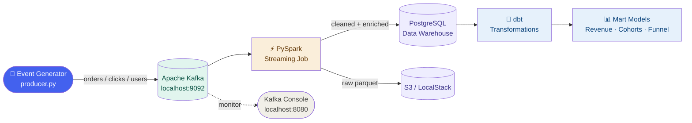

# Real-Time E-Commerce Analytics Pipeline

> A production-grade pipeline built with Kafka, PySpark, dbt, Airflow, and AWS


---

## Architecture



---

## Project Structure

```
de-ecommerce-pipeline/
├── docker-compose.yml       # Local infrastructure (Kafka, Postgres, etc.)
├── requirements.txt         # Python dependencies
├── producer/
│   └── producer.py          # Publishes fake e-commerce events to Kafka
├── consumer/
│   └── consumer.py          # Consumes and validates events
├── spark/
│   └── transform.py         # PySpark transformation jobs
├── dbt/                     # dbt transformation models
├── airflow/
│   └── dags/                # Airflow pipeline DAGs
└── README.md
```

---

## Tech Stack

| Layer | Tool | Purpose |
|---|---|---|
| Ingestion | Apache Kafka | Event streaming |
| Processing | PySpark | Data transformation |
| Storage | PostgreSQL + S3 | Data warehouse + data lake |
| Transformation | dbt | SQL models + testing |
| Orchestration | Airflow | Pipeline scheduling |
| Cloud | AWS | Production deployment |
| IaC | Terraform | Infrastructure as code |

---

## Quick Start

### Prerequisites
- Docker Desktop running
- Python 3.10+

### Run locally
```bash
# Start infrastructure
docker compose up -d

# Activate virtual environment
.\venv\Scripts\Activate.ps1

# Install dependencies
pip install -r requirements.txt

# Run event producer
python producer/producer.py
```

---

## Roadmap

- [x] Month 1 — Kafka ingestion layer
- [ ] Month 2 — PySpark + Postgres + S3
- [ ] Month 3 — dbt transformation models
- [ ] Month 4 — Airflow orchestration
- [ ] Month 5 — AWS deployment
- [ ] Month 6 — Portfolio polish + job search

---

## Author

**Jeyrome Orosco**  
[LinkedIn](https://www.linkedin.com/in/jeyromeorosco/) · [GitHub](https://github.com/jeyromeorosco)